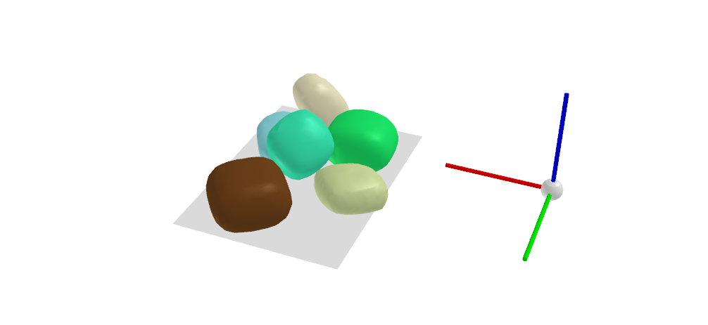

# SuperQuadric scene generator
Generates scenes of cluttered SuperQuadric shapes. 

1) A scene is generated inside the PyBullet simulator using a collection of Superquadric shapes.
    
    a) Download the collection of Superquadric shapes from [superquadric_models](https://drive.google.com/file/d/1CMJca_4V_87AYjjEEtqXF05GimTHNqJZ/view?usp=sharing)
    
    b) Run the 'generate_dataset.py' script in RadomSceneGenerator

2) Each scene can be transformed into a TSDF representation. 

    a) Run the 'create_dataset.py' script in DatasetCreation. Setting per_instance_scene=True 
    in the optional arguments will generate a tsdf grid for every individual Superquadric.
