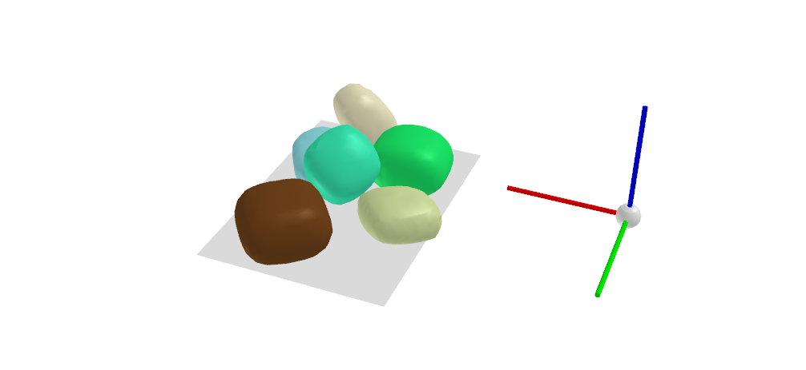

# SuperQuadric scene generator

Dataset generation pipeline for the project:

SIMstack: A Generative Shape and Instance Model for unordered object stacks (ICCV 2021)

Zoe Landgraf, Raluca Scona, Tristan Laidlow, Stephen James, Stefan Leutenegger, Andrew Davison

Visit the [project page](https://zoelandgraf.github.io/SIMstack/) for more details and link to the paper. 

### Installation
create your virtual conda env from the environment.yml file

### Scene generation
1) A scene is generated inside the PyBullet simulator using a collection of Superquadric shapes.
    
    a) Download the collection of Superquadric shapes from [superquadric_models](https://drive.google.com/file/d/1CMJca_4V_87AYjjEEtqXF05GimTHNqJZ/view?usp=sharing)
    
    b) Run the 'generate_dataset.py' script in RadomSceneGenerator. The script takes the following input:

        positional arguments:
   
        out_dir               destination path to new dataset
   
        model_dir             path to SQ models
   
        n_scenes              number of scenes to generate

        optional arguments:

         --min_objects MIN_OBJECTS
                        minimum number of objects in the scene (default: 4)
   
         --max_objects MAX_OBJECTS
                        maximum number of objects in the scene (default: 8)
   
         --gui GUI             gui? True (default: None)
   
         --n_processes N_PROCESSES
                        multiprocessing: number of processes (default: 1)

2) Each scene can be transformed into a TSDF representation. 

    a) Run the 'create_dataset.py' script in DatasetCreation. 
   
        positional arguments:
         
          scene_dir             path to generated dataset
          
          model_dir             path to SQ models

        optional arguments:
  
         --n_processes N_PROCESSES
                        multiprocessing: number of processes (default: 1)

         --per_instance_scene PER_INSTANCE_SCENE
                        create per instance tsdf and voxelgrids (default:
                        None)

    Setting per_instance_scene=True 
    in the optional arguments will generate a tsdf grid for every individual Superquadric.

### Visualisation
visualize a generated scene using the 'visualizer.py' script in DatasetCreation 
Simply running the script will visualise the default scene in the examples folder.